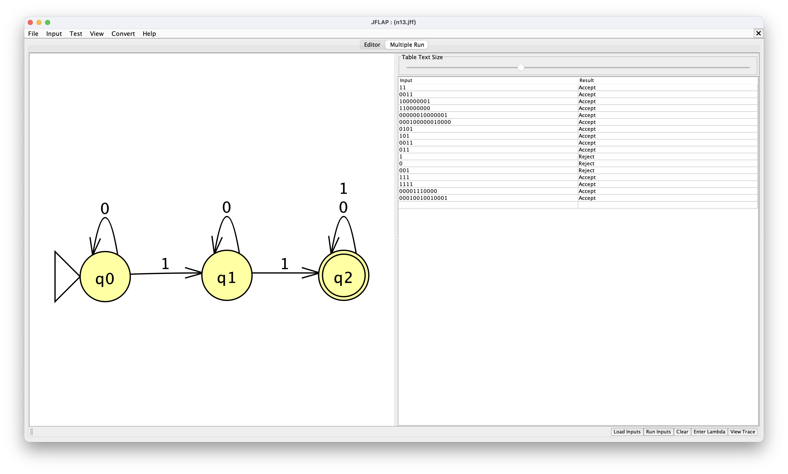

# Let Σ = { 0, 1 }

### Problem 13:  

Design a NFA M such that L(M) = {string <i>s</i> | <i>s</i> contains at least 2 1's }

### Design:

<h3>Which problem(s) gave you the most trouble?</h3> 
This design was simple. no notes
