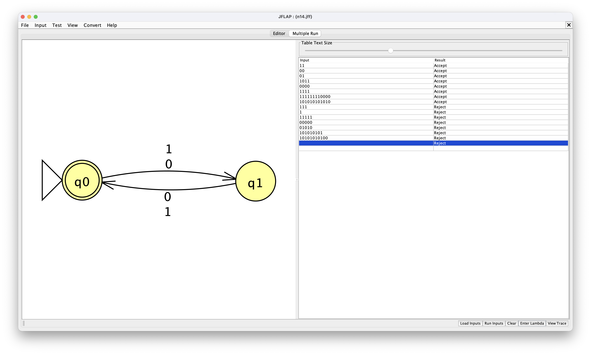

# Let Σ = { 0, 1 }

### Problem 14:

Design a NFA M such that L(M) = {string <i>s</i> | length of <i>s</i> is even}

### Design:

<h3>Which problem(s) gave you the most trouble?</h3> 
This design was simple. no notes
